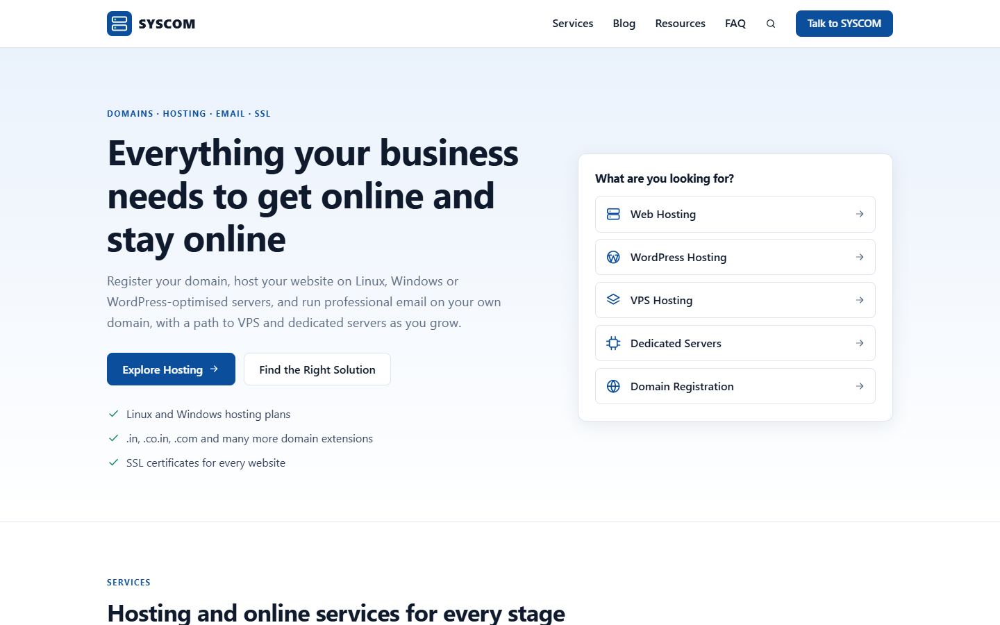

# SYSCOM GrowthHub

An SEO-focused growth platform for **[SYSCOM](https://syscom.co.in)** built with **PHP 8, MySQL, HTML5, CSS3 and vanilla JavaScript**.

It pairs a fast, search-friendly public website with an admin workspace that runs the whole organic growth loop:

```
Keyword → Content → Landing page → Internal links → Organic discovery → Lead
```

> Built for the SYSCOM INDIA Full Stack Development internship assignment:
> *"Design & develop a web application to increase brand value & SEO ranking for syscom.co.in."*
> Full write-up: [docs/DOCUMENTATION.md](docs/DOCUMENTATION.md)
>
> **Live demo**
>
> | | URL | Role |
> | --- | --- | --- |
> | **Frontend (Vercel)** | https://syscom-growthhub.vercel.app | Public entry point on Vercel's CDN; forwards every request to the backend |
> | **Backend (Render)** | https://syscom-growthhub.onrender.com | PHP 8.3 + Apache + MySQL (MariaDB) container that renders the pages and runs the admin |
>
> Admin: `/admin/` on either URL. Free instances sleep when idle, so the first request can take up to a minute, and demo data is restored on every restart.



---

## 1. Project overview

GrowthHub is built around what actually moves organic growth, following Google's
[SEO Starter Guide](https://developers.google.com/search/docs/fundamentals/seo-starter-guide):
useful content, a crawlable structure, correct technical signals and genuine off-page reputation.

It does **not** fake anything. There are no invented rankings, traffic, search volumes, backlinks or "Google scores".
The SEO health score is labelled everywhere as an internal checklist score.

## 2. Features

| Area | What it does |
| --- | --- |
| **Public website** | Home, services, service detail, blog, articles, resources hub, FAQ, contact, keyword landing pages, friendly 404 |
| **SEO engine** | Unique titles/descriptions, canonical URLs, robots meta, Open Graph, JSON-LD (Organization, WebSite, Article, Service, BreadcrumbList, FAQPage), dynamic `sitemap.xml` and `robots.txt`, clean URLs with 301 normalisation |
| **CMS** | Articles (draft / publish / schedule / unpublish), services, FAQs, landing pages, slug management, secure featured-image upload, live SERP preview and on-page checklist |
| **Keyword manager** | Intent, priority, target URL and status for each keyword, plus an automatic **on-page coverage check** of the target page |
| **Landing page engine** | Fixed template (hero → problem → solution → features → benefits → use cases → FAQ → form) with guards against thin or doorway pages |
| **Internal linking engine** | Phrase → URL rules applied safely on the DOM: first mention only, never inside headings or links, never self-links, capped per page |
| **SEO auditor** | Fetches any public URL and checks 11 on-page factors. Scores, saves history and shows findings. Protected against SSRF |
| **Off-page tracker** | Directory, citation, social, guest-post and PR pipeline with **real link verification** (fetches the source page) |
| **Lead generation** | Contact and landing-page forms with CSRF, honeypot, signed timing token, rate limiting and source-page attribution. Lead inbox with CSV export |
| **Content health** | Dashboard panel that finds missing or duplicate meta tags, thin articles, keyword cannibalisation and broken keyword mappings |
| **AI assistant** *(optional)* | Suggests meta titles/descriptions and article outlines via OpenRouter. Drafts only; disabled unless a key is configured |
| **Growth dashboard** | KPI cards with real 30-day trends, an interactive six-stage growth loop (keyword → content → landing page → internal links → discovery → lead), lead trend chart, top opportunities, activity timeline |
| **Opportunity centre** | Keyword, content-gap, internal-link, landing-page, backlink and technical opportunities computed from the site's own data, each with reason, recommended action and a done/dismiss workflow |
| **Technical SEO** | Health cards (indexability, crawlability, canonicals, sitemap, robots, meta, OpenGraph, schema, URLs, headings, images, mobile, accessibility), structured-data inventory with a local property check, sitemap manager, robots.txt editor with validation |
| **Analytics** | Leads, conversion, content output, keyword coverage and off-page charts from real data; traffic and rankings clearly shown as *not connected* instead of estimated |
| **Admin UX** | Global search with typeahead (press `/`), notification centre, quick actions, breadcrumbs, sortable/filterable tables that become cards on mobile, confirmation modals, toasts, loading skeletons, activity history on every record, users & roles |

## 3. Architecture

```
Browser ─▶ Apache (.htaccess) ─▶ index.php (front controller) ─▶ pages/*.php (views)
                                         │
                                         ├─▶ includes/  (bootstrap, security, SEO, schema, markdown, UI)
                                         └─▶ modules/   (business logic, PDO) ─▶ MySQL
Admin: admin/*.php ─▶ admin/_init.php (auth + CSRF guard) ─▶ modules/
API:   api/audit.php, api/ai.php (admin only), api/search.php (public, read-only)
```

A single front controller gives every public URL the same bootstrap, 404/301 handling and SEO output, and allows
landing pages at the root (`/web-hosting-india`). Business logic lives in `modules/` as plain functions over PDO,
with no framework, so any PHP developer can follow it.

```
syscom-growthhub/
├── index.php            front controller + clean-URL router
├── router.php           router for PHP's built-in dev server (mirrors .htaccess)
├── sitemap.php          /sitemap.xml
├── robots.php           /robots.txt
├── .htaccess            rewrites, private folders, caching
├── config/              config.php, config.local.example.php, database.php
├── includes/            bootstrap, auth, csrf, flash, security, seo, schema, markdown, validation, uploads, ui
├── modules/             content, categories, services, landing-pages, faqs, keywords, linking, backlinks, distribution,
│                        leads, audit, seo (health, checklist, technical, opportunities), analytics, search, settings, ai
├── pages/               public page templates
├── admin/               admin screens (dashboard, CRUD, auditor, settings)
├── api/                 JSON endpoints
├── assets/              css, js, images, uploads (script execution disabled)
├── database/            schema.sql, seed.sql, installer, seed data
├── tests/               dependency-free unit + HTTP integration suite
└── docs/                documentation and screenshots
```

## 4. Tech stack

- **Frontend:** semantic HTML5, CSS3 (custom properties, grid, mobile-first), vanilla JavaScript (progressive enhancement only)
- **Backend:** PHP 8.1+ (tested on 8.3), PDO with native prepared statements, cURL, DOMDocument/XPath, GD, fileinfo
- **Database:** MySQL 5.7+/8.0 or MariaDB 10.4+ (InnoDB, utf8mb4)
- **Server:** Apache with `mod_rewrite` (XAMPP locally)
- **No frameworks, no Composer packages, no external CDNs or fonts**

## 5. Requirements

- PHP 8.1 or newer with `pdo_mysql`, `curl`, `dom`, `mbstring`, `fileinfo`, `gd`, `intl` (recommended)
- MySQL 5.7+ / MariaDB 10.4+
- Apache 2.4 with `mod_rewrite` and `AllowOverride All`

## 6. Installation (XAMPP)

```bash
# 1. Put the project in htdocs
cd C:/xampp/htdocs
git clone https://github.com/vaibhav410/SEO.git syscom-growthhub

# 2. Start Apache and MySQL from the XAMPP control panel
```

## 7. Database setup

**Option A: phpMyAdmin**
1. Open `http://localhost/phpmyadmin` → **Import** → choose `database/schema.sql` → Go.
2. Import `database/seed.sql` the same way to load demo content.

**Upgrading an existing install** (created before categories, analytics and opportunities were added):
`mysql -u root -p syscom_growthhub < database/migrations/002_growth_os.sql`

**Option B: command line**
```bash
php database/install.php            # schema + demo data
php database/install.php --no-seed  # schema only
```

## 8. Configuration

Defaults suit a stock XAMPP install (`root`, empty password, database `syscom_growthhub`,
URL `http://localhost/syscom-growthhub`). To change anything, copy the example file:

```bash
cp config/config.local.example.php config/config.local.php
```

`config.local.php` is git-ignored. Every value can also come from environment variables:
`APP_URL`, `APP_DEBUG`, `APP_SECRET`, `DB_HOST`, `DB_PORT`, `DB_NAME`, `DB_USER`, `DB_PASS`,
`AUDIT_ALLOW_SELF`, `OPENROUTER_API_KEY`, `AI_MODEL`.

| Setting | Purpose |
| --- | --- |
| `app.base_url` | Public URL without a trailing slash. Used for canonicals, sitemap and Open Graph. Sub-folders work. |
| `app.debug` | Show error details. **Keep `false` in production.** |
| `app.secret` | Long random string used to hash visitor IPs and sign form timing tokens |
| `audit.allow_self` | Allow the auditor to fetch this app's own origin when it runs on localhost |
| `ai.api_key` | Optional OpenRouter key for the AI assistant |

## 9. Admin login

Demo data creates an admin account:

| Email | Password |
| --- | --- |
| `admin@syscom.local` | `Admin@12345` |

**Change it before deploying anywhere public**, either from *Settings → Change your password* or with:

```bash
php database/create-admin.php "Your Name" you@example.com "a-strong-password" admin
```

Roles: `admin` (everything) and `editor` (content and SEO, no settings).

## 10. Local development

With XAMPP, open `http://localhost/syscom-growthhub/` and `/admin/`.

Without Apache, use PHP's built-in server (`router.php` reproduces the `.htaccess` rules):

```bash
php -S 127.0.0.1:8080 router.php
# set app.base_url = http://127.0.0.1:8080 in config.local.php
```

> The built-in server handles one request at a time, so auditing the app's **own** pages from inside it would wait
> on itself. Audit external URLs there, or use Apache/XAMPP for self-audits.

## 11. SEO features

- **Metadata**: one reusable `seo()` helper per page gives a unique title (brand suffix only when it fits), a meta description trimmed to 160 characters, an absolute canonical, robots, Open Graph and Twitter cards
- **Structured data**: JSON-LD built only from visible content. FAQ schema appears only where FAQs are shown. Output is hex-escaped so content can't break out of the script tag
- **URLs**: `/services/web-hosting`, `/blog/what-is-an-ssl-certificate`, `/web-hosting-india`. Trailing slashes, upper-case and `/index.php` 301 to one URL; malformed slugs 404; paginated archives get self-canonicals
- **Sitemap**: published services, articles (including scheduled ones once they go live) and landing pages with `lastmod`. Drafts, admin and search pages are never listed
- **robots.txt**: allows the site, disallows `/admin/`, `/api/`, private folders and search results, and links the sitemap
- **Crawlable structure**: breadcrumbs (visible and schema), resources hub, related guides, footer links to every service and solution, automatic contextual internal links
- **Performance**: no external requests, system fonts, ~22 KB of CSS, deferred JS, lazy images with dimensions, versioned assets with long cache headers
- **Accessibility**: one H1 per page, logical headings, labels on every input, skip link, visible focus, `aria-current`, native `<details>` FAQs, reduced-motion support

## 12. Security

| Threat | Protection |
| --- | --- |
| SQL injection | PDO native prepared statements everywhere; identifiers only from code whitelists |
| XSS | `e()` escaping on all output; safe Markdown subset (HTML escaped first, `javascript:` links dropped); JSON-LD hex-escaped; strict Content-Security-Policy with no inline scripts or styles |
| CSRF | Per-session token checked with `hash_equals` on every POST (forms and `X-CSRF-Token` for AJAX); logout is POST-only |
| Auth | `password_hash` / `password_verify` with rehash, session ID regenerated on login, idle timeout, login throttling (5 attempts / 15 min per IP or email), constant-time failure path |
| Authorization | Every admin page and API goes through `require_admin()` with role checks; settings are admin-only |
| Sessions | HttpOnly, SameSite=Lax, Secure on HTTPS, strict mode |
| SSRF (auditor) | http/https on ports 80/443 only; no credentials in URLs; every resolved IP must be public (loopback, private, link-local, CGNAT, metadata, multicast and IPv6 equivalents blocked); DNS pinned with `CURLOPT_RESOLVE`; each redirect re-validated; size and time limits |
| Uploads | Size limit, MIME checked by `finfo`, extension allow-list, decoded and **re-encoded with GD**, random file names, script execution disabled in `assets/uploads/` |
| Spam | Honeypot, HMAC-signed minimum fill time, per-IP rate limit using a keyed hash (raw IPs are never stored) |
| Info leaks | Friendly 404/403/419/429/500/503 pages; details only in `storage/logs/app.log`; private folders denied by `.htaccess`; `X-Powered-By` removed |
| Other | `X-Frame-Options: DENY`, `nosniff`, Referrer-Policy, Permissions-Policy, HSTS on HTTPS, CSV-injection-safe exports |

## 13. Testing

```bash
php tests/run.php          # 89 unit + integration tests
php tests/run.php --unit   # unit tests only (no DB needed)
```

The suite creates its own `syscom_growthhub_test` database, starts a server on port 8099 and covers routing,
SEO output, sitemap/robots, forms (empty, invalid, oversized, SQL injection, XSS, CSRF, honeypot, rate limit),
authentication and roles, the CMS lifecycle (create, draft, publish, slug conflict, unpublish, delete), growth
modules, and the auditor (SSRF, invalid URL, live fetch). See the test matrix in
[docs/DOCUMENTATION.md](docs/DOCUMENTATION.md#13-testing).

## 14. Deployment

### Live architecture

```
Visitor ─▶ Vercel (syscom-growthhub.vercel.app, CDN, vercel/vercel.json rewrite)
              └─▶ Render (syscom-growthhub.onrender.com, Docker: Apache + PHP + MariaDB)
```

Render's `APP_URL` is set to the Vercel URL, so canonical links, the sitemap and robots.txt use the Vercel domain.
The `vercel/` folder contains only the rewrite config; to redeploy it: `cd vercel && vercel deploy --prod`.

### Render (Docker backend)

The repository includes a `Dockerfile` (Apache + PHP 8.3 + MariaDB in one container) and a `render.yaml` blueprint.

1. In Render choose **New → Blueprint** and select this repository (or create a Docker web service from it).
2. Set `ADMIN_PASSWORD` to a strong password. It replaces the public demo password at every start. `APP_SECRET` is generated automatically.
3. Deploy. The container starts MariaDB, writes its config from the environment (debug off, proxy-aware client IPs), installs the schema and demo data, then starts Apache on Render's port.

The bundled database is **ephemeral**: free instances have no persistent disk, so data resets to the demo content on each restart. For a persistent setup, remove MariaDB from the image and set `DB_HOST`, `DB_USER`, `DB_PASS` and `DB_NAME` for a managed MySQL database.

### Classic hosting (Apache + PHP + MySQL)

1. Upload the files to any Apache + PHP 8.1 host (shared hosting works).
2. Create the database and import `database/schema.sql` (and `seed.sql` if you want demo content).
3. Create `config/config.local.php` with the production `base_url` (https), DB credentials, a long random `secret` and `debug => false`.
4. Enable HTTPS and uncomment the HTTPS redirect in `.htaccess`.
5. Make `storage/logs/` and `assets/uploads/` writable by the web server.
6. Change the admin password, set the real contact details and social profiles in **Settings**.
7. Submit `https://your-domain/sitemap.xml` in Google Search Console.

## 15. Future improvements

- Google Search Console API import for **real** impressions, clicks and positions per keyword
- Scheduled re-audits and a broken-link crawler across the whole site
- Image optimisation pipeline (WebP variants and `srcset`)
- Email notification for new leads (SMTP)
- Revision history for articles and a rich-text editor option
- Multi-language content with `hreflang`

---

© Vaibhav Kumar Kanojia. Built for the SYSCOM INDIA internship assignment.
