# SYSCOM GrowthHub: Project Documentation

**Author:** Vaibhav Kumar Kanojia
**Assignment:** Full Stack Development Internship, SYSCOM INDIA
**Brief:** Design and develop a web application to increase brand value and SEO ranking for https://www.syscom.co.in,
focusing on off-page SEO, free/organic traffic, high-intent keyword targeting and long-term sustainable growth.
**Stack (as required):** HTML5, CSS3, PHP, MySQL (plus vanilla JavaScript for progressive enhancement)

---

## Contents

1. [Executive summary](#1-executive-summary)
2. [Problem statement](#2-problem-statement)
3. [Proposed solution](#3-proposed-solution)
4. [Product architecture](#4-product-architecture)
5. [Technology stack](#5-technology-stack)
6. [Database architecture](#6-database-architecture)
7. [SEO architecture](#7-seo-architecture)
8. [Module architecture](#8-module-architecture)
9. [User flow](#9-user-flow)
10. [Admin flow](#10-admin-flow)
11. [Security](#11-security)
12. [Performance](#12-performance)
13. [Testing](#13-testing)
14. [SEO strategy](#14-seo-strategy)
15. [Off-page SEO strategy](#15-off-page-seo-strategy)
16. [Future scope](#16-future-scope)

---

## 1. Executive summary

SYSCOM sells domains, web hosting, WordPress hosting, VPS, dedicated servers, reseller hosting, business email and
SSL certificates. These are competitive, high-intent search markets in India. Organic search is the most sustainable
free acquisition channel for this kind of business, but only if the website is technically sound, answers real
questions, and earns genuine trust signals from other sites.

**SYSCOM GrowthHub** is a PHP/MySQL web application with two halves:

- a **public, SEO-first website** (services, guides, keyword landing pages, FAQ, lead forms) that demonstrates the technical and content standards the brief asks for, and
- an **admin growth workspace** that runs the organic growth loop end to end: plan keywords, publish content and landing pages, interlink them automatically, audit pages, track off-page work, and capture and attribute leads.

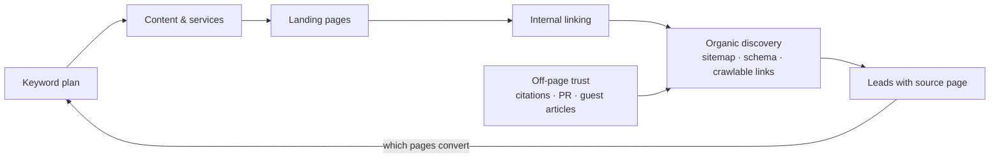

The application deliberately avoids anything that fakes results: no invented rankings, traffic or search volumes,
no automated link building, no doorway pages. The SEO health score is clearly labelled as an internal checklist
score, not a Google metric. This matches Google's guidance and SYSCOM's long-term interest.

**Key results**

| Area | Outcome |
| --- | --- |
| Public pages | 9 page types, every one with a single H1, unique title and description, canonical, Open Graph and valid JSON-LD |
| Admin modules | 11 (dashboard, articles, services, landing pages, FAQs, keywords, internal links, auditor, off-page, leads, settings) |
| Automated tests | **72 passing** unit and HTTP integration tests |
| Live audit of syscom.co.in | 69/100 internal score, with concrete, fixable findings (see §14.3) |

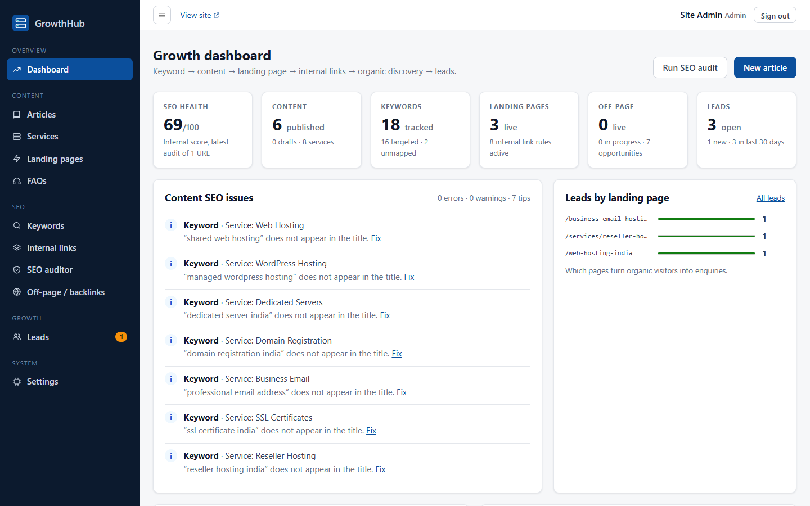

---

## 2. Problem statement

1. **Competitive, high-intent keywords.** Searches like "web hosting india", "buy domain name india" and "business email hosting" are dominated by large providers. Ranking needs focused, useful pages, one per intent, rather than one generic homepage.
2. **Technical SEO gaps.** An audit of the live syscom.co.in homepage with this tool found no canonical tag, no Open Graph tags, no responsive viewport meta tag, no `lang` attribute and six H1 headings (§14.3). The public sitemap also lists login and legal query URLs and one malformed URL.
3. **Little educational content.** Buyers research before choosing a host. Without guides answering their questions, SYSCOM misses informational searches, the chance to build trust early, and the internal links that pass authority to service pages.
4. **Off-page work is untracked.** Directory listings, citations, guest articles and PR mentions need a pipeline so they get followed up and verified.
5. **No feedback loop.** Without knowing which pages generate enquiries, content effort can't be prioritised.

---

## 3. Proposed solution

| Brief requirement | How GrowthHub addresses it |
| --- | --- |
| **Off-page SEO** (backlinks, social signals, directories) | Off-page tracker for directories, citations (NAP), social profiles, guest articles, PR and partners. Pipeline Opportunity → Submitted → Pending → Live/Rejected. **Verify** fetches the source page to confirm the link and its rel type. Organization schema `sameAs` links official social profiles. |
| **Free / organic traffic** | Fast, crawlable, mobile-first site. Unique metadata, structured data for rich results (FAQ, breadcrumbs, articles), dynamic sitemap, resources hub, related-content and automatic internal links. |
| **High-intent keyword targeting** | Keyword plan with search intent, priority and one target URL per keyword. Coverage checks confirm the target page covers the keyword. Dedicated landing pages for commercial intents. Cannibalisation detection. |
| **Long-term sustainable growth** | Ethical, guideline-compliant practices only. Content health monitoring, audit history, lead-source attribution and a maintainable codebase with tests. |
| **Highly SEO-optimised app** | Every public page scores 100/100 on the built-in auditor (on HTTPS; locally the only note is "served over HTTP"). |

---

## 4. Product architecture

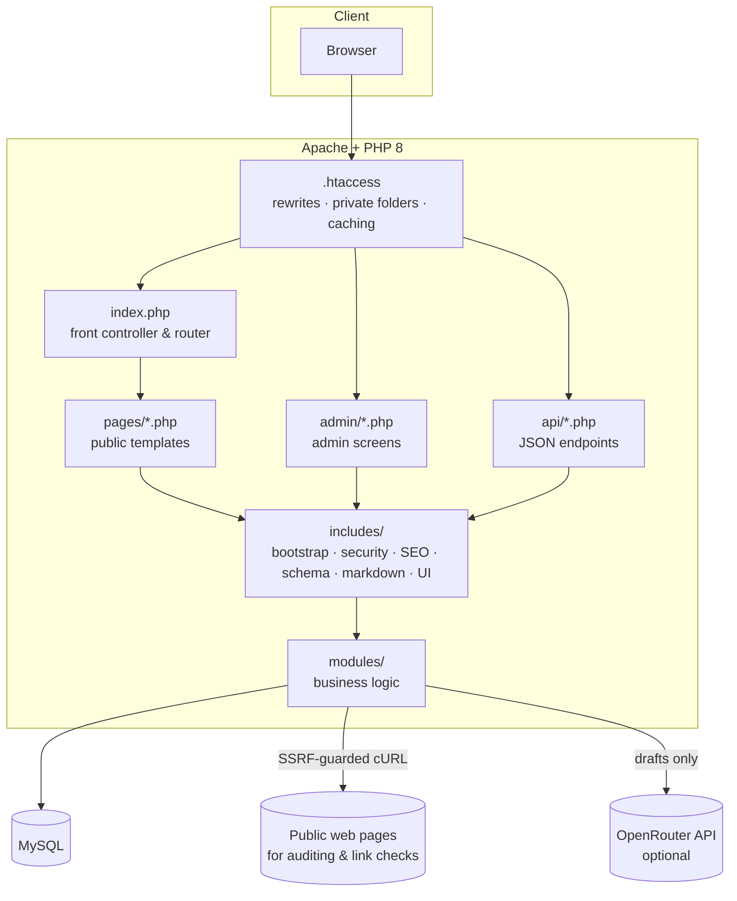

**Request lifecycle (public page)**

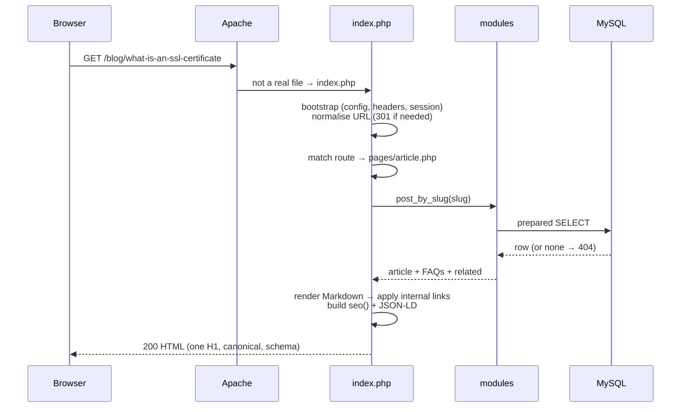

**Design decisions**

- **Front controller instead of one PHP file per page.** One entry point gives every URL the same bootstrap, security headers, 301 normalisation and 404 handling. It also enables root-level landing pages (`/web-hosting-india`) while blocking reserved words.
- **Plain functions over PDO instead of a framework.** It meets the required stack, keeps dependencies at zero, and any PHP developer can read it top to bottom.
- **Server-rendered HTML, progressive enhancement.** Every feature works without JavaScript. JS adds the mobile menu, live SEO counters, search suggestions and the AJAX audit.
- **Sub-folder support.** All URLs go through `url()` / `absolute_url()` with a configured `base_url`, so the app runs at `http://localhost/syscom-growthhub` on XAMPP or at a domain root.

---

## 5. Technology stack

| Layer | Technology | Why |
| --- | --- | --- |
| Markup | Semantic HTML5 | Accessibility and machine-readable structure for search engines |
| Styling | CSS3 (custom properties, grid, flexbox), mobile-first, system fonts | No render-blocking web fonts, no framework, ~22 KB total |
| Behaviour | Vanilla JavaScript (deferred) | Progressive enhancement; nothing required for content |
| Server | PHP 8.1+ | Required by the brief; typed, modern syntax |
| Data access | PDO with native prepared statements | SQL injection protection by construction |
| Database | MySQL / MariaDB (InnoDB, utf8mb4) | Required by the brief; FKs and full Unicode |
| Web server | Apache + `mod_rewrite` | Clean URLs; XAMPP locally, shared hosting in production |
| HTML parsing | DOMDocument + DOMXPath | Auditor and link engine work on the DOM, not regex |
| HTTP client | cURL | Timeouts, redirect control, DNS pinning for SSRF protection |
| Images | GD + fileinfo | Validate and re-encode uploads |
| Tooling | VS Code, Git/GitHub, phpMyAdmin | As specified |

---

## 6. Database architecture

Eleven normalised tables plus a login-throttle table.

```mermaid
erDiagram
    users ||--o{ posts : "writes"
    users ||--o{ seo_audits : "runs"
    services ||--o{ posts : "related to"
    services ||--o{ landing_pages : "related to"
    services ||--o{ faqs : "has"
    posts ||--o{ faqs : "has"
    landing_pages ||--o{ faqs : "has"

    users { int id PK; varchar email UK; varchar password_hash; enum role }
    services { int id PK; varchar slug UK; varchar name; text content; varchar meta_title; varchar meta_description; enum status }
    posts { int id PK; varchar slug UK; varchar title; mediumtext content; varchar primary_keyword; int service_id FK; int author_id FK; enum status; datetime published_at }
    landing_pages { int id PK; varchar slug UK; varchar primary_keyword; text problem; text solution; text features; int service_id FK; enum status }
    faqs { int id PK; int service_id FK; int post_id FK; int landing_page_id FK; varchar question; text answer; enum status }
    keywords { int id PK; varchar keyword UK; enum intent; enum priority; varchar target_url; enum status }
    internal_links { int id PK; varchar keyword UK; varchar target_url; tinyint priority; enum status }
    backlinks { int id PK; varchar platform; enum type; varchar source_url; varchar target_url; enum rel; enum status; datetime last_checked_at }
    leads { int id PK; varchar email; varchar source_page; enum status; char ip_hash }
    seo_audits { int id PK; varchar url; smallint http_status; tinyint overall_score; json issues; json stats }
    settings { int id PK; varchar setting_key UK; text setting_value }
```

**Notes**

- **Indexes** on every lookup path: unique `slug` columns, `(status, published_at)` for the blog, `(status, sort_order)` for services, `(ip_hash, created_at)` for rate limiting, `(status, created_at)` for the lead inbox, and a FULLTEXT index on posts for future search.
- **Referential integrity:** deleting a service, article or landing page cascades to its FAQs; deleting a service or user sets related posts' FKs to NULL instead of deleting content.
- **FAQs** use three nullable FKs rather than a polymorphic "type/id" pair, so the database can enforce integrity. All three NULL means a general FAQ.
- **No search-volume column** on `keywords`, by design. Volumes must come from a real source and can be recorded in notes with that source.
- **Privacy:** leads store a keyed HMAC of the IP (for rate limiting), never the raw address.
- `database/schema.sql` imports in phpMyAdmin. `database/seed.sql` is generated from `database/seed/*.php`, so demo data has a single source of truth.

---

## 7. SEO architecture

### 7.1 On-page signals (every public page)

| Signal | Implementation |
| --- | --- |
| `<title>` | From the page's meta title (or title). Brand suffix added only if it keeps the title within about 65 characters. Paginated pages add "Page N". Uniqueness is covered by tests. |
| Meta description | From the meta description, excerpt or subtitle, trimmed on a word boundary to 160 characters |
| Canonical | Absolute, self-referencing. Paginated archives canonicalise to themselves; search results are `noindex, follow` |
| Robots | `index, follow` by default; `noindex` on 404, search results, admin (also sent as the `X-Robots-Tag` header) |
| Open Graph / Twitter | title, description, url, type (`article` for posts), image (featured image or the branded default) |
| Headings | Exactly one H1 per page (the template owns it; Markdown `#` becomes H2); logical H2/H3 sections; table of contents on articles |
| Images | Alt text required when a featured image is uploaded; width/height set; lazy loading |
| Language | `<html lang="en-IN">`, `og:locale en_IN` |

### 7.2 Structured data (JSON-LD, only for visible content)

| Page | Types |
| --- | --- |
| Home | Organization (+ `sameAs` social profiles and contactPoint only if configured), WebSite, FAQPage |
| Service | Service (provider → Organization), FAQPage, BreadcrumbList |
| Article | Article (author, dates, publisher, image), FAQPage, BreadcrumbList |
| Landing page | FAQPage, BreadcrumbList |
| Services / Blog / Resources / Contact | BreadcrumbList |
| FAQ | FAQPage (every question shown on the page), BreadcrumbList |

### 7.3 URLs and crawling

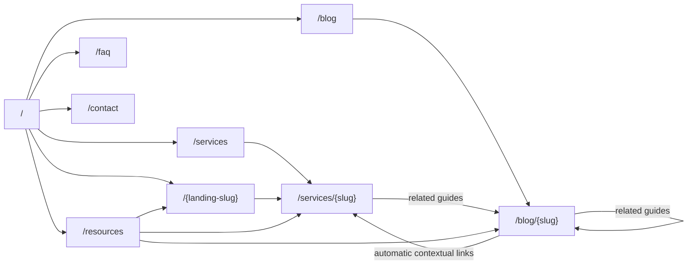

- **Clean URLs** via `.htaccess` → `index.php`. Slugs must match `^[a-z0-9]+(-[a-z0-9]+)*$`; anything else is a 404.
- **One URL per page:** trailing slash, upper case and `/index.php` 301 to the canonical form.
- **Reserved slugs** (`blog`, `services`, `admin`, …) can never become landing pages.
- **Sitemap** (`/sitemap.xml`, generated with XMLWriter): hubs plus published services, articles (only once their publish date passes) and landing pages, with `lastmod`.
- **robots.txt** (`/robots.txt`): allows the site, disallows admin/API/private folders and search results, and references the absolute sitemap URL.

### 7.4 Internal linking engine

The engine renders Markdown to HTML, loads it into DOMDocument and walks only prose text nodes, skipping anything
inside `a`, `h1`–`h4`, `code`, `pre` and `th`. For each active rule (highest priority first, longer phrases first) it links the
**first** whole-phrase match, unless:

- the target is the current page,
- the author already links to that target, or
- the per-page cap (Settings, default 5) is reached.

Because it edits the DOM, it can never nest links or break attributes. The admin screen shows a live preview of
which links each article receives.

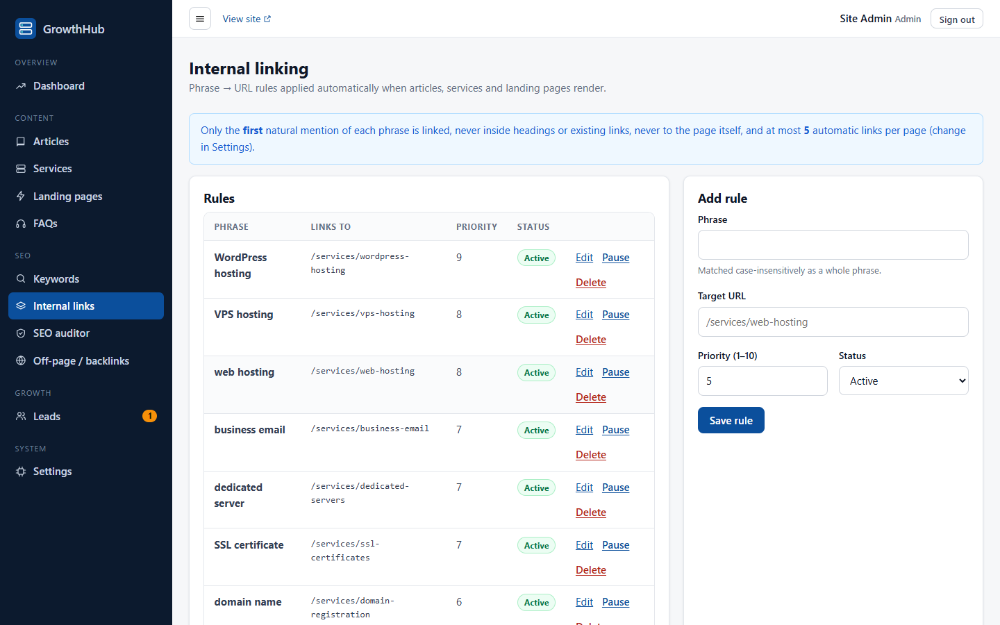

### 7.5 SEO auditor

Checks and weights (sum = 100):

| Check | Weight | Pass condition |
| --- | --- | --- |
| Title tag | 15 | Present, single, 30–60 characters |
| Meta description | 15 | Present, 70–160 characters |
| H1 | 10 | Exactly one |
| Heading structure | 5 | Has H2s, no skipped levels |
| Canonical | 10 | Exactly one, absolute |
| Indexability | 5 | No `noindex` (meta or `X-Robots-Tag`) |
| Open Graph | 10 | og:title, description, image, url |
| Structured data | 10 | Valid JSON-LD or microdata |
| Image alt text | 10 | Share of images with alt attributes |
| Internal links | 5 | At least 3 internal links |
| Mobile & language | 5 | Responsive viewport meta + `lang` |

It also reports HTTP status, response time, redirect chain, word count, link counts (internal, external, nofollow),
schema types and HTTPS usage. Results are saved with history per URL.

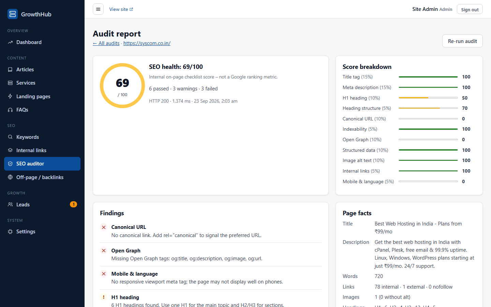

---

## 8. Module architecture

| Module (`modules/`) | Responsibility | Admin screen |
| --- | --- | --- |
| `content/posts.php` | Article queries, scheduling rule, search, validation, persistence | Articles |
| `services/services.php` | Service catalogue | Services |
| `landing-pages/landing_pages.php` | Landing pages, reserved slugs, anti-thin-content validation | Landing pages |
| `faqs/faqs.php` | FAQs for general, service, article and landing owners | FAQs |
| `keywords/keywords.php` | Keyword plan, path → content resolver, coverage scoring | Keywords |
| `linking/linker.php` | DOM-safe internal link injection and rules | Internal links |
| `audit/url_guard.php` | SSRF-safe URL validation and IP classification | (used by auditor and backlinks) |
| `audit/auditor.php` | Fetch, analyse, score, persist audits | SEO auditor |
| `backlinks/backlinks.php` | Off-page pipeline and live link verification | Off-page / backlinks |
| `leads/leads.php` | Lead capture, spam defences, inbox queries, source attribution | Leads |
| `seo/content_health.php` | Database-wide SEO issue detection | Dashboard |
| `settings/settings.php` | Cached key/value settings | Settings |
| `ai/assistant.php` | Optional AI meta/outline drafts | Buttons in editors |

Shared infrastructure in `includes/`: `bootstrap`, `functions`, `errors`, `security`, `csrf`, `flash`, `auth`,
`validation`, `uploads`, `seo`, `schema`, `markdown`, `ui`, `admin_ui`, `header`/`footer`.

---

## 9. User flow

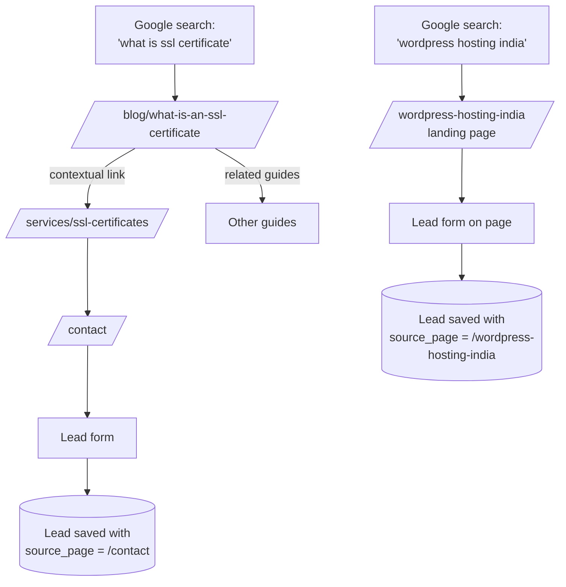

A visitor lands from search on the page matching their intent. Informational visitors read a guide, follow a
contextual link to the relevant service, and enquire. Commercial visitors land on a focused landing page with the
form on the page. Every lead records which page generated it.

---

## 10. Admin flow

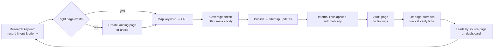

Editors get a live SERP preview, character counters, an on-page checklist and optional AI suggestions while
writing. The dashboard shows live counts, the content-health issue list, recent audits, recent content and leads
by landing page.

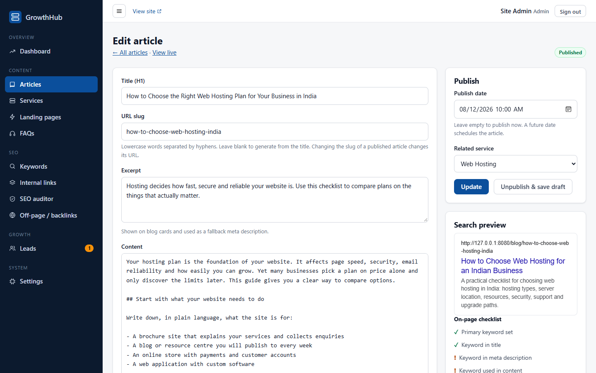

---

## 11. Security

| Risk | Mitigation | Where |
| --- | --- | --- |
| SQL injection | Native prepared statements only (`ATTR_EMULATE_PREPARES=false`); table/column names from code allow-lists; LIMIT/OFFSET cast to int; LIKE wildcards escaped | `config/database.php`, all modules |
| XSS | `e()` on every output; Markdown escapes HTML first and drops unsafe URL schemes; JSON-LD hex-escaped; CSP `script-src 'self'; style-src 'self'` (no inline code anywhere) | `includes/functions.php`, `markdown.php`, `schema.php`, `security.php` |
| CSRF | Random 256-bit token per session, `hash_equals`, required on every POST (forms and the AJAX header); logout POST-only | `includes/csrf.php`, `admin/_init.php` |
| Broken authentication | bcrypt via `password_hash`; automatic rehash; `session_regenerate_id` on login; 2-hour idle timeout; throttling of 5 failures per 15 minutes per IP or email; dummy hash verification to avoid user enumeration by timing | `includes/auth.php` |
| Broken access control | `require_admin()` on every admin page and API with role lists (settings admin-only); API returns 401 JSON | `includes/auth.php` |
| Session attacks | HttpOnly, SameSite=Lax, Secure on HTTPS, strict mode, cookie path scoped to app | `includes/security.php` |
| SSRF | Scheme and port allow-list, no credentials, rejects internal host names, resolves A/AAAA and rejects any non-public IP (RFC 1918, loopback, link-local/metadata, CGNAT, multicast, reserved, IPv6 ULA/link-local, IPv4-mapped), pins DNS with `CURLOPT_RESOLVE` to stop rebinding, re-validates every redirect hop, 3 MB and 12 s limits | `modules/audit/url_guard.php`, `auditor.php` |
| Malicious uploads | 2 MB limit, `finfo` MIME detection, extension allow-list, `getimagesize`, GD decode and re-encode (strips payloads/EXIF), random names, no script execution in uploads folder | `includes/uploads.php`, `assets/uploads/.htaccess` |
| Spam and abuse | Honeypot, HMAC-signed timestamp (at least 3 s, at most 24 h), 3 leads per 10 minutes per hashed IP, AI endpoint throttle | `modules/leads/leads.php`, `api/ai.php` |
| Information disclosure | Debug off by default; friendly error pages; logs outside the web root (denied folder); private folders denied; `X-Powered-By` removed; secrets only in git-ignored `config.local.php` | `includes/errors.php`, `.htaccess` |
| Clickjacking and sniffing | `X-Frame-Options: DENY`, `frame-ancestors 'none'`, `nosniff`, Referrer-Policy, Permissions-Policy, HSTS on HTTPS | `includes/security.php` |
| Open redirect | Post-login redirect only to paths under `/admin/` | `admin/login.php` |
| CSV injection | Cells beginning with `= + - @` are prefixed in exports | `admin/leads/index.php` |

---

## 12. Performance

- **No third-party requests** on public pages: no web fonts, CDNs, analytics scripts or frameworks.
- **Small payloads:** ~22 KB CSS, ~3.5 KB JS (deferred), inline SVG icons, a single OG image.
- **Caching:** assets versioned by file modification time (`?v=`) and served with one-year immutable cache headers; compression via `mod_deflate`.
- **Efficient queries:** indexed lookups by slug and status. Settings, published services, landing pages and link rules are loaded once per request and memoised. Aggregations on the dashboard use single queries.
- **Rendering:** a typical page makes 4–6 small indexed queries. Internal linking runs on one DOM pass per rule over already-rendered HTML.
- **Images:** uploads resized to at most 1600 px and re-compressed; `loading="lazy"` with explicit dimensions to avoid layout shift.

---

## 13. Testing

`php tests/run.php` runs **72 automated tests** (no dependencies). Integration tests use a separate
`syscom_growthhub_test` database and their own server on port 8099.

| Area | Cases covered | Result |
| --- | --- | --- |
| Authentication | valid login, invalid login, login without CSRF, throttling after 5 failures, guest access to admin pages redirected, API 401, editor blocked from settings (403), GET logout ignored, POST logout ends session | ✅ |
| CMS | create draft (not public, not in sitemap), publish (public, in sitemap, internal links applied), slug conflict, validation errors keep input, unpublish (404), delete, admin POST without CSRF rejected, services with FAQ schema, landing reserved slug, landing thin-content guard | ✅ |
| SEO | one H1, title ≤ 65 characters, unique titles, description length, absolute canonical, og:title on 9 page types; JSON-LD valid and correct types; sitemap valid XML without private URLs; robots.txt; 404 noindex; 301 normalisation; paginated 404 | ✅ |
| Forms | empty fields, invalid email, over-long input, SQL injection payload stored literally, XSS payload escaped, missing/forged CSRF, honeypot, instant submission, rate limit | ✅ |
| Search | reflected XSS escaped and noindexed; SQL injection in `q` and API | ✅ |
| SEO auditor | good page = 100, poor page low with specific issues, malformed and empty HTML, relative redirects, private IP / localhost / metadata blocked (unit and API), invalid URL, live public URL end to end | ✅ |
| Security helpers | Markdown XSS, `javascript:` links, schema `</script>` escape, CIDR maths, IPv6 and IPv4-mapped addresses, signed timing tokens | ✅ |
| Internal linking | first occurrence only, skips headings/links/code, no self-links, respects author links, per-page cap, whole-phrase matching | ✅ |
| Error handling | DB outage → 503 page with no SQL or credentials shown (manual); missing content → 404 | ✅ |
| Responsive | Desktop 1440 px, tablet, mobile 375/390 px checked in Chromium: no horizontal overflow, working menu, no console errors (manual, Playwright) | ✅ |

Mobile views:

| Home | Article |
| --- | --- |
|  | 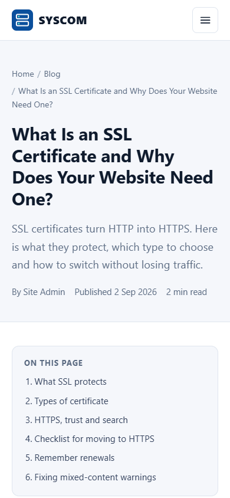 |

---

## 14. SEO strategy

### 14.1 Principles

Following Google's SEO Starter Guide and spam policies:

1. **Help people first.** Each page answers a specific question or need better than a generic page would.
2. **One intent, one page.** Keywords are grouped by intent and mapped to exactly one URL to avoid cannibalisation (detected automatically on the dashboard).
3. **Make it easy to crawl and understand.** Clean URLs, logical hierarchy, internal links, sitemap, structured data that matches visible content.
4. **Earn trust off-site.** Real listings, citations and editorial mentions, never bought or automated links.
5. **Measure honestly.** Use Search Console for real impressions and positions; use the internal audit score only as a checklist.

### 14.2 Keyword and content plan (seeded)

| Intent | Example keywords | Page type |
| --- | --- | --- |
| Transactional | buy domain name india, ssl certificate india | Service page with clear CTA and link to plans on syscom.co.in |
| Commercial | web hosting india, wordpress hosting india, business email hosting india, vps hosting india | Dedicated landing page or service page |
| Informational | how to choose web hosting, shared vs vps hosting, what is ssl certificate, custom domain email, website backup | Blog guide linking to the matching service |
| Navigational | syscom hosting | Home page |

Search volumes are intentionally not included. They should be validated in Google Keyword Planner or Search Console
before prioritising, and recorded with their source.

### 14.3 Findings from auditing the live syscom.co.in homepage

Audited with GrowthHub's own auditor on 23 Sep 2026: **69/100** internal score (HTTP 200, http→https redirect in place).

| Finding | Impact | Recommendation |
| --- | --- | --- |
| No `rel="canonical"` | Duplicate URL variants (with/without `www`, query strings) can split signals | Add a self-referencing absolute canonical to every page |
| No Open Graph tags | Links shared on LinkedIn, WhatsApp and Facebook show no controlled title, description or image, which weakens social signals | Add og:title, og:description, og:image (1200×630), og:url |
| No responsive viewport meta | Google indexes mobile-first; the page may render as desktop on phones | Add `<meta name="viewport" content="width=device-width, initial-scale=1">` |
| Six H1 headings, skipped heading levels | Dilutes the main topic of the page | One H1 describing the page; H2/H3 for sections |
| No `lang` on `<html>` | Accessibility and language detection | `<html lang="en-IN">` |
| Sitemap lists `login.php?...` and legal query URLs, plus a malformed `dedicated-servers-windows.php'` | Wastes crawl budget; the malformed URL returns an error | List only canonical, indexable pages; fix the malformed entry |
| ✓ Title, description, structured data, image alt text and internal linking are good | | Keep |

These are exactly the kinds of issues GrowthHub is designed to catch and prevent on pages it manages.

### 14.4 Content roadmap

- **Month 1:** fix the technical issues above; publish landing pages for each core commercial intent; guides for the top informational questions.
- **Months 2–3:** comparison and "how to" guides (e.g. Titan vs Google Workspace, migrating a WordPress site, .in vs .com); FAQs from real support questions.
- **Ongoing:** refresh guides quarterly (the `dateModified` in Article schema updates automatically), audit key pages after changes, prune or merge underperforming pages.

---

## 15. Off-page SEO strategy

Off-page SEO is about **reputation**: other trustworthy sites mentioning and linking to SYSCOM because it is useful.
GrowthHub tracks this work; it does not automate it.

| Channel | Action | Tracked as |
| --- | --- | --- |
| **Local citations** | Google Business Profile, Bing Places, Justdial, Sulekha with identical name, address and phone (NAP) | `citation` / `directory` |
| **B2B directories** | IndiaMART, TradeIndia, Clutch/GoodFirms (if eligible) with a full, accurate profile | `directory` |
| **Social profiles** | LinkedIn company page, X, YouTube (how-to videos); listed as `sameAs` in Organization schema | `social` |
| **Guest articles** | Original guides for Indian startup, SME and web-developer blogs (e.g. "WordPress speed checklist"); no paid links | `guest_post` |
| **Digital PR** | Data-backed or genuinely newsworthy stories (new data-centre region, security advisories) | `pr` |
| **Partners** | Web-design agencies and reseller partners linking to SYSCOM as their hosting provider | `partner` |
| **Communities** | Helpful answers on Quora, Reddit and developer forums; links only where relevant (usually nofollow/UGC, valuable for brand discovery) | `forum` |

**Link quality rules built into the process:** varied, natural anchor text (brand, URL, descriptive); record the
rel type (follow, nofollow, ugc, sponsored) honestly; never buy or exchange links for ranking; verify with the
built-in checker that a reported link actually exists before marking it live.

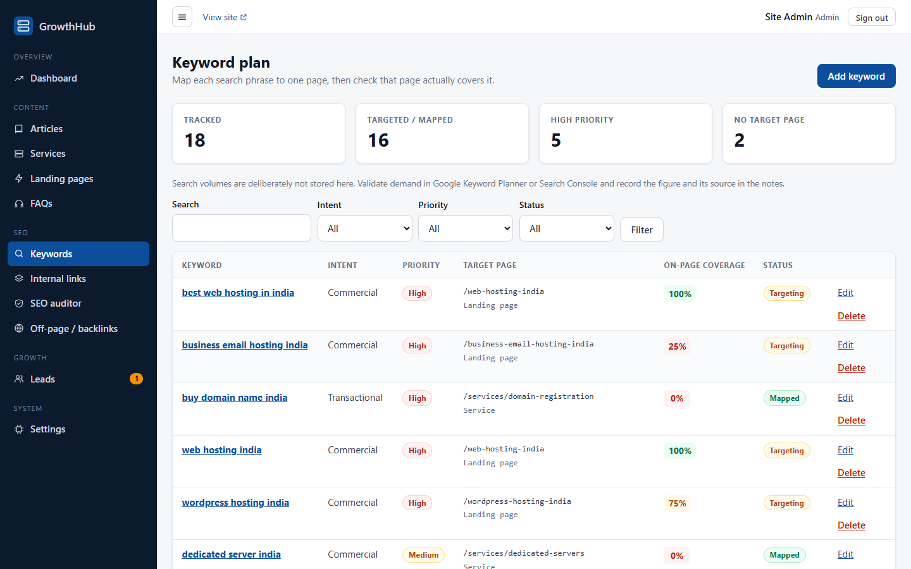

---

## 16. Future scope

- **Google Search Console API** integration to import real impressions, clicks, CTR and average position per page and keyword, closing the measurement loop with real data.
- **Scheduled audits and site crawler:** nightly re-audits of key pages, broken-link detection, redirect-chain and orphan-page reports.
- **Backlink monitoring:** periodic re-verification of live links with alerts when a link disappears.
- **Image pipeline:** WebP/AVIF variants with `srcset` and automatic alt-text suggestions for review.
- **Lead notifications and CRM export:** email/SMS alerts, webhooks.
- **Editorial workflow:** revision history, review/approval states, a rich-text editor option.
- **Internationalisation:** Hindi content with `hreflang`.
- **Core Web Vitals monitoring** via the PageSpeed Insights API.
